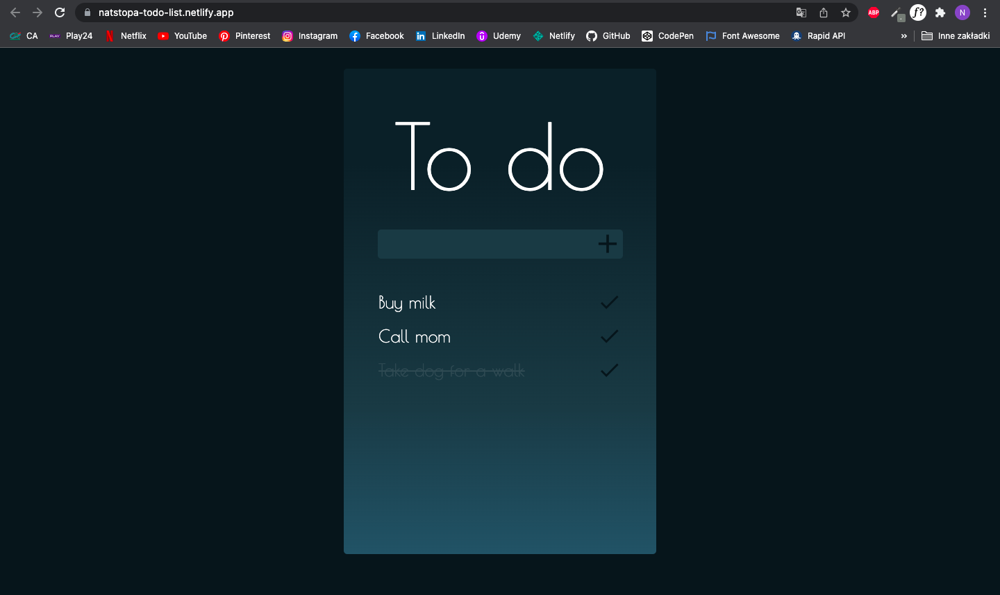

# To Do - task list website
## A responsive To Do Website built with HTML, CSS and Vanilla JavaScript.

### This web page is hosted here!
> https://natstopa-todo-list.netlify.app/

## Table of Contents
* [General Info](#general-information)
* [Technologies Used](#technologies-used)
* [Features](#features)
* [Screenshots](#screenshots)
* [Project Status](#project-status)
* [Room for Improvement](#room-for-improvement)
* [Sources](#sources)
* [Author](#author)

## General Information
This application was created to improve our daily work by listing the tasks that we have To Do. 
It allows us to manage our time better, be more productive, and motivates us to work.
I love making to-do lists, that's why this app was also made for me!   
 
While writing this application, I wanted to learn how to use local storage with which I have never worked before.

## Technologies Used
* HTML5
* CSS3
* Vanilla JavaScript

## Features
* Simple Interface
* Local Storage supported
* Responsive on all devices

## Screenshots

## Project status
Project is: _in progress_ 

## Room for Improvement
* Make Interface more User friendly
* Fix a bug with dissapearing task when you undo one of them
* Fix responisiveness

## Sources
* Fonts: Poiret One by [Google Fonts](https://fonts.google.com/specimen/Poiret+One?query=poiret)
* Icons: [Google Fonts Icons](https://fonts.google.com/icons)
>This Website is based on Udemy [Creative Javascript Course](https://www.udemy.com/course/the-creative-javascript-course/) by Dev Ed

## Author
Created by [Nat Stopa](https://natstopa-portfolio.netlify.app/)
